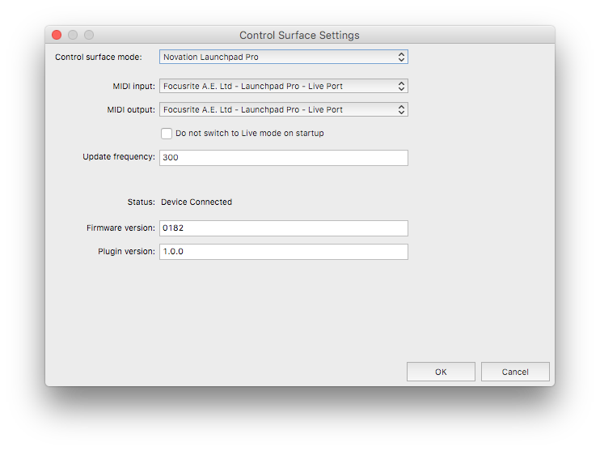
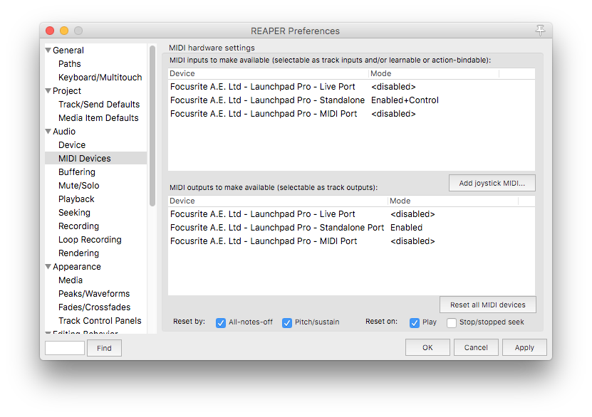
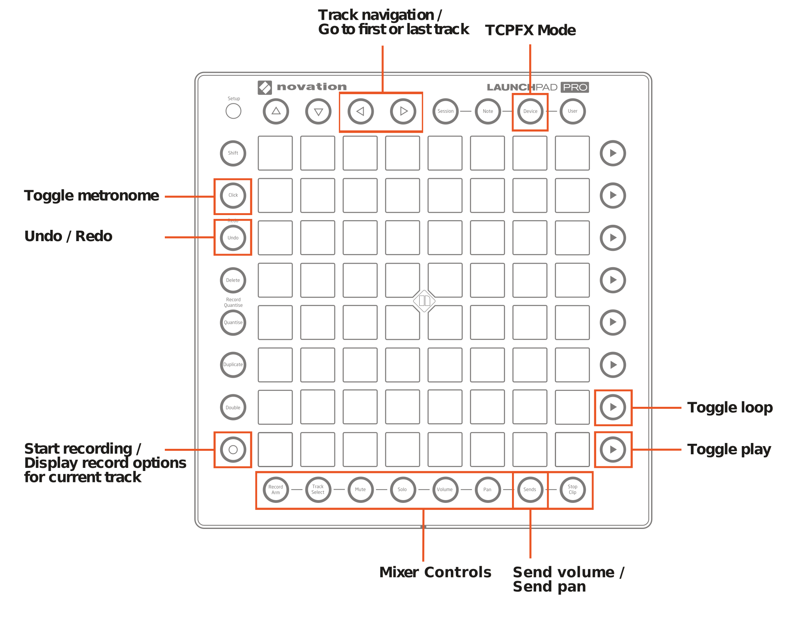
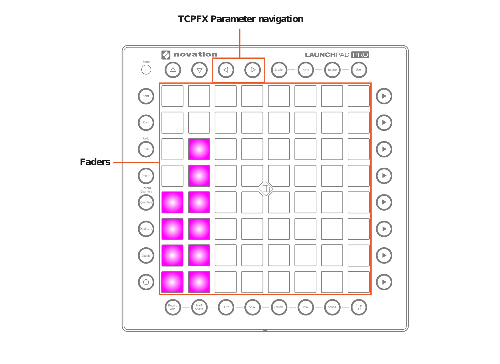
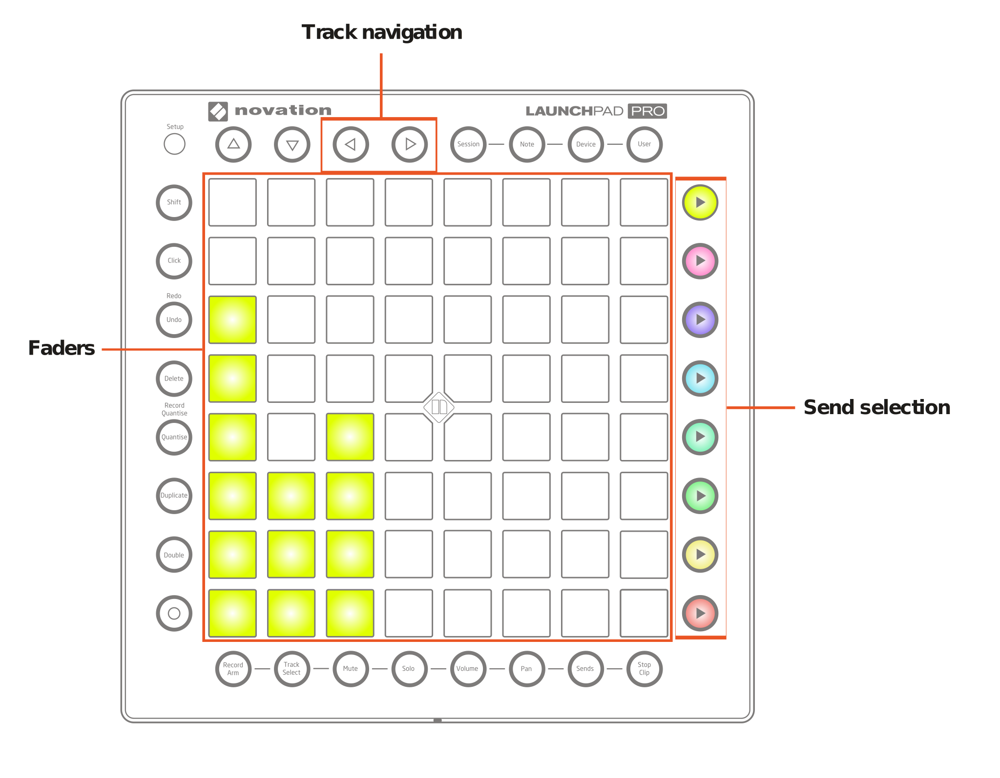

# Launchpad Pro Control Surface Driver for REAPER - 1.0.0

This is control surface driver for REAPER. It mimics session mode for Ableton where possible and where it makes sense. Driver for REAPER is provided for macOS and Windows.

Readers should be familiar with functionality of Launchpad Pro covered in its user guide.

Special thanks to cfillion, Xenakios and nofish for help with building and to Cockos for REAPER.

If you like this driver and want to support me, feel free to [donate via PayPal](https://www.paypal.com/cgi-bin/webscr?cmd=_donations&business=9U862G5RH2KML&lc=CZ&item_name=PB&item_number=Launchpad%20Pro%20Driver%20for%20REAPER&currency_code=USD&bn=PP%2dDonationsBF%3abtn_donateCC_LG%2egif%3aNonHosted ). It will allow me to acquire more gadgets - like Launchpad Pro and to spend time developing REAPER support for them.

# Setup
In Reaper, go to *Preferences* -> *Control/OSC/Web*, click *Add* and select *Novation Launchpad Pro*. Plugin configuration window will appear.

Settings are following:

- *MIDI input* - select port for Live, e.g. **Focusrite A.E. Ltd - Launchpad Pro -Live port**.
- *MIDI output* - select port for Live, e.g. **Focusrite A.E. Ltd - Launchpad Pro -Live port**.
- *Do not switch to Live mode on startup* - If you do not want REAPER to switch Launchpad Pro to Live mode immediately.
- *Update frequency* - interval in milliseconds after which surface is updated in Device mode when value is changed in TCPFX control. (for details, see below)

There are several read-only fields in plugin configuration for convenience:

- *Status* - Shows *Device connected* when Launchpad Pro  responded correctly to device inquiry message.
- *Firmware version* - Firmware version installed on Launchpad Pro
- *Plugin version* - version of this plugin

Then, go to *Preferences* -> *Audio* -> *MIDI Devices* and select Standalone USB MIDI port in order to be able to use Launchpad Pro as MIDI instrument for playing notes.

# Usage

Following image displays button functions. If button supports second function through pressed *Shift* button, function is described after slash.

As with normal Live mode, each mode can be either toggled or momentarily switched. To toggle mode, press and release button quickly. To enter momentary mode, press and hold mode button, perform operations in that mode and then release mode button.

In order to use Launchpad Pro as MIDI controller, it needs to be switched either to Note mode or Drum mode via *Setup* button. For details, see user's manual.

Following modes are provided:

- *Record arm* - track arming, multiple tracks can be armed at once
- *Track select* - track selecting, single track can be selected at once
- *Mute* - track muting, multiple tracks can be muted
- *Solo* - track soloing, multiple tracks can be soloed
- *Volume* - track volume control, multiple tracks can be volume controlled, pad velocity controls fader speed
- *Pan* - track pan control, multiple tracks can be pan controlled
- *Sends Volume* - track send volume control, multiple tracks can have send volume controlled
- *Sends Pan* - entered by pressing *Shift* + *Sends* buttons; track send pan control, multiple track can have send pan controlled
- *TCPFX Mode* - entered by pressing Device button; requires exactly one track selected.
- *Session mode* - default empty mode, does not provide means to manipulate tracks

Most modes do not need further explanation. However, some do.

## TCPFX Mode

*Device* button enters mode similar to Device mode in Ableton where one can define controls that are available to controller. REAPER allows plugin controls to be displayed on Track Control Panel. Such parameters can be controlled by faders in TCPFX mode. Exactly one track needs to be be selected in order to switch to this mode, otherwise grid blinks twice with purple light and Launchpad is switched back to session mode.

Faders displayed in this mode allows controlling plugin parameters with controls on Track Control Panel.

## Sends and Sends Pan Modes

These modes allow you to control levels and panning of sends on multiple tracks. When switching to this mode, buttons on right side change color and allow you selecting send. For this send, you can then control level / pan on all tracks. Faders / panpots have color of currently selected send.

Left and right arrows move tracks in most modes. In TCPFX mode, they scroll device parameters for given track. When pressed with *Shift* key, they go to first or last track.

*Undo* button performs undo or, when pressed with *Shift*, redo is performed. *Click* button toggles metronome state. *Record* button starts recording immediately. Last play button in right column starts/stops playback.

## Limitations
- On Windows, control surface is not switched away from Live mode when exiting REAPER.

## Legal

All product names, logos, and brands are property of their respective owners. All company, product and service names used in this document are for identification purposes only. Use of these names, logos, and brands does not imply endorsement.

## Build instructions

Some time passed since I built this, so feel free to correct any inaccuracies. This code is not my best code and is far from perfect. Given limited time I had for this and C++ not being language I am proficient in, I did my best to develop it working, in short time and avoided causing too much problems.

Check out sources of [WDL](https://github.com/justinfrankel/WDL) and place it next to this source directory

On Mac, PHP is required in order to build. Run

    compile-mac.sh

On Windows, install Visual Studio (tested with 2017), run *x64 Native Tools Command Prompt for VS 2017* and after changing directory to current project directory, run following commands:

    rc -fo res.res res.rc
    cl /nologo /O2 /Z7 /Zo csurf_launchpadpro.cpp res.res /link winmm.lib user32.lib /DEBUG /OPT:REF /PDBALTPATH:%_PDB% /DLL /OUT:reaper_csurf_launchpadpro.1.0.0.dll

## Further development ideas

- Add support for precise fader values. Matrix is 64 buttons, this would allow entering 128 values. When touching fader with some modifier key, one could use whole matrix and allow user to press button with desired value. As each button would have two value, first and second press would siwtch low and high value of the button.

## Various useful links:

https://stackoverflow.com/questions/9339851/can-one-add-further-source-files-to-an-executable-once-defined

https://dmerej.info/blog/post/cmake-visual-studio-and-the-command-line/
https://docs.microsoft.com/en-us/windows/desktop/menurc/renaming-the-compiled-resource-file
https://docs.microsoft.com/en-us/cpp/build/building-on-the-command-line?view=vs-2017
https://gist.github.com/cfillion/f32b04e75e84e03cc463abb1eda41400
https://stackoverflow.com/questions/7724569/debug-vs-release-in-cmake
https://stackoverflow.com/questions/35805113/visual-studio-2015-run-time-dependencies-or-how-to-get-rid-of-universal-crt
